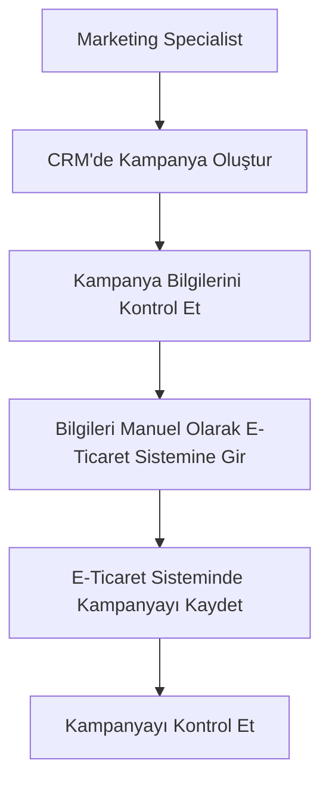
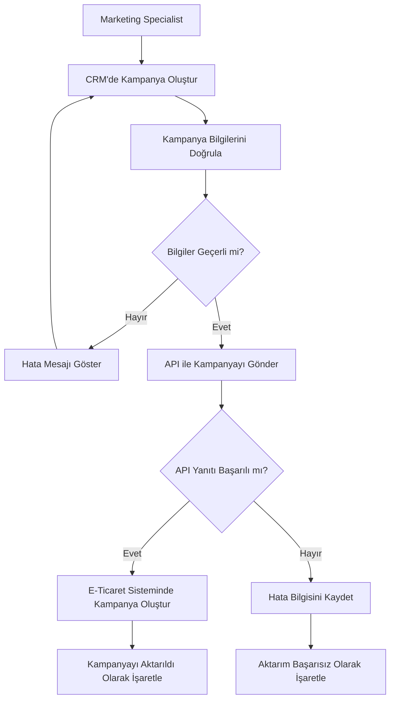

# Process Flow Analysis

## 1. AS-IS Process

Mevcut süreçte CRM üzerinde oluşturulan kampanya bilgileri e-ticaret sistemine manuel olarak aktarılmaktadır.

### AS-IS Süreç Adımları

1. Marketing Specialist CRM üzerinde kampanya oluşturur.
2. Kampanya bilgileri kontrol edilir.
3. Kampanya bilgileri e-ticaret sistemine manuel olarak girilir.
4. Kampanya e-ticaret sisteminde kaydedilir.
5. Kampanyanın doğru oluşturulduğu kontrol edilir.

### AS-IS Süreç Problemleri

* Manuel veri girişi bulunmaktadır.
* Aynı bilgiler iki farklı sisteme girilmektedir.
* Veri giriş hatası oluşabilir.
* Kampanyanın aktarılması zaman almaktadır.
* Aktarım sonucu için manuel kontrol gerekmektedir.

---

## 2. TO-BE Process

Önerilen süreçte CRM üzerinde oluşturulan kampanya bilgileri doğrulandıktan sonra API aracılığıyla e-ticaret sistemine aktarılmaktadır.

### TO-BE Süreç Adımları

1. Marketing Specialist CRM üzerinde kampanya oluşturur.
2. Kampanya bilgileri sistem tarafından doğrulanır.
3. Bilgiler geçersizse kullanıcıya hata gösterilir.
4. Bilgiler geçerliyse kampanya API aracılığıyla e-ticaret sistemine gönderilir.
5. E-ticaret sistemi API isteğini işler.
6. Başarılı yanıt alınırsa kampanya oluşturulur.
7. Kampanya aktarımı başarılı olarak işaretlenir.
8. API hata döndürürse hata bilgisi kayıt altına alınır.
9. Kampanya aktarımı başarısız olarak işaretlenir.

---

## 3. AS-IS vs TO-BE

| Konu               | AS-IS          | TO-BE               |
| ------------------ | -------------- | ------------------- |
| Kampanya oluşturma | CRM            | CRM                 |
| Veri aktarımı      | Manuel         | API                 |
| Veri doğrulama     | Manuel kontrol | Sistemsel doğrulama |
| Hata yönetimi      | Manuel takip   | Hata kaydı          |
| E-ticaret aktarımı | Manuel         | Otomatik            |
| İşlem takibi       | Manuel         | Sistem üzerinden    |

## 4. Process Improvement

TO-BE süreç ile hedeflenen iyileştirmeler:

* Manuel veri girişinin azaltılması
* Veri doğruluğunun artırılması
* Kampanya aktarım süresinin azaltılması
* Hataların daha kolay takip edilmesi
* CRM ve e-ticaret sistemleri arasındaki veri akışının standartlaştırılması
